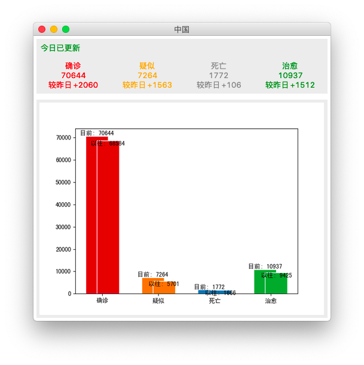
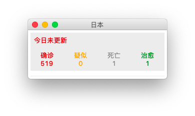
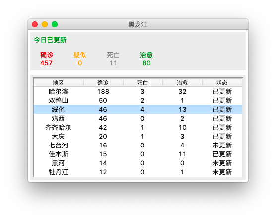

# 2019-nCoV

&#160; &#160; &#160; &#160; 本项目用于获取并展示目前世界范围内感染“2019-nCoV”病毒的人数。通过Python提供的Tkinter工具包来构建GUI程序，采用Python的numpy、matplotlib实现数据可视化。

&#160; &#160; &#160; &#160; 本项目的目的在于练习自己的Python编程以及数据可视化的利用，同时希望能为人们提供一种新的数据分析角度。

## 程序功能

- _**世界级数据展示**_

- [ ] 内容包括各个国家各类数据(确诊、疑似、死亡和治愈病例数)占比等。

- _**国家级数据展示**_

- [x] 内容包括国家各类数据对比(“目前”数据和“以往”数据)展示。





- [ ] 对于中国来说，针对各种数据展示进行完善。

- _**省份级数据展示**_

- [x] 对于每个省份，将省份内各城市数据进行展示。




## 安装与使用

&#160; &#160; &#160; &#160; 下载完整项目至本地，在当前目录下执行main.py即可(由于程序内使用了“相对路径”，故请确保在当前目录下执行)。

&#160; &#160; &#160; &#160; 首先，执行命令

```
$ git clone https://github.com/Modnars/2019-nCoV.git
```

&#160; &#160; &#160; &#160; 或

```
$ git clone git@github.com:Modnars/2019-nCoV.git
```

&#160; &#160; &#160; &#160; 然后执行

```
$ cd 2019-nCoV/
```

```
$ ./main.py
```

## 声明

> Author : Modnar
> Date: 2020/02/11
> Copyrights (c) 2020 Modnar. All rights reserved.

